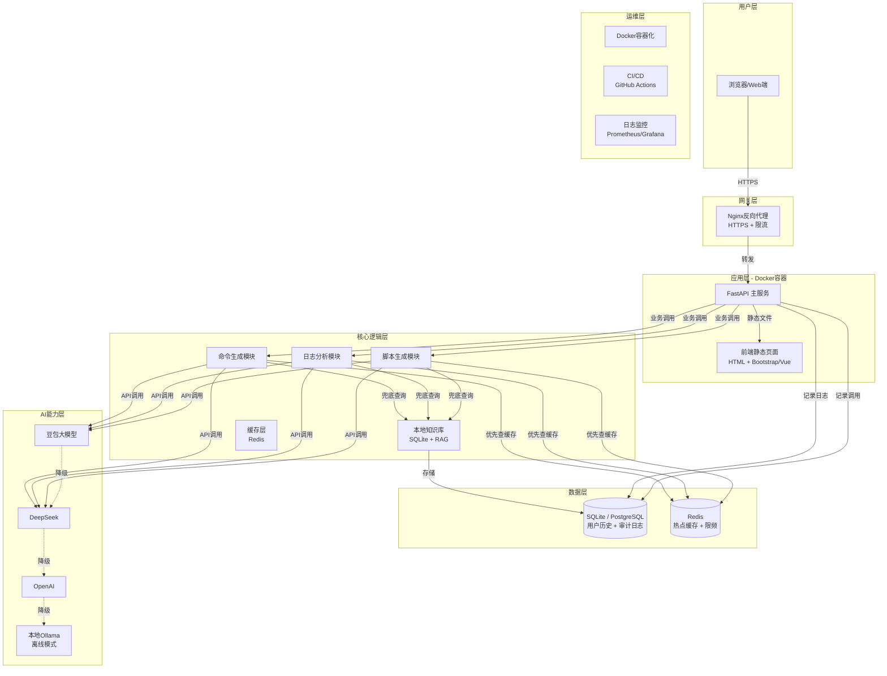
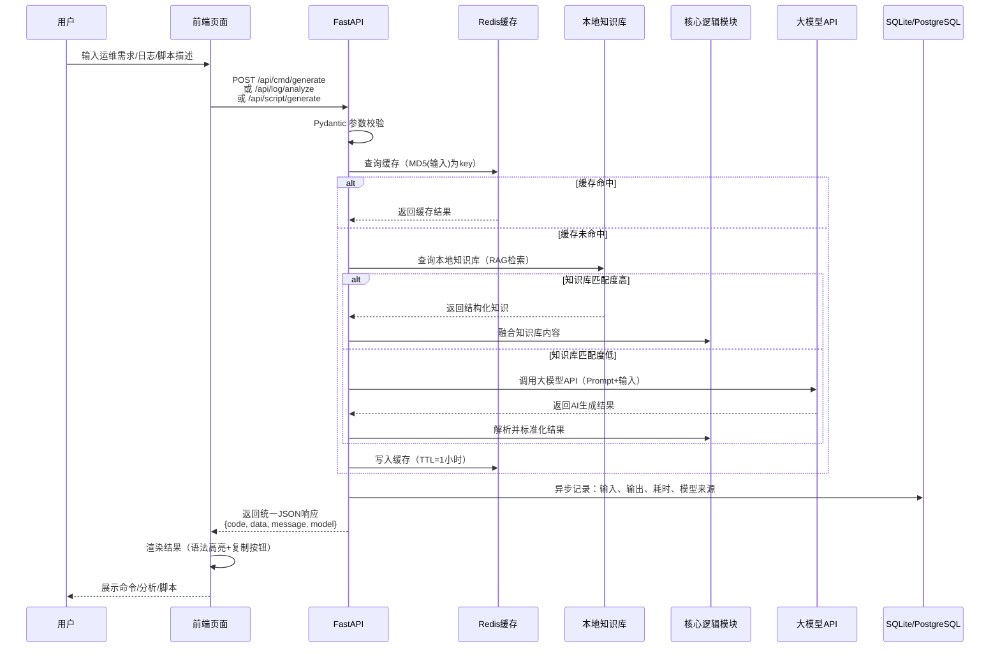

# CloudOps AI 运维助手 — 优化方案与迭代路线图

> 基于完整开发文档的分析与建议，本文档包含系统架构图、数据流图、部署架构图以及按优先级排序的迭代任务清单。

---

## 一、系统架构图（优化版）



---

## 二、数据流图（单请求完整链路）



---

## 三、部署架构图（生产环境）

```mermaid
graph TB
    subgraph 公网层
        A[用户浏览器]
        B[域名 + DNS]
        C[HTTPS证书<br/>Let's Encrypt]
    end

    subgraph 云服务器<br/>阿里云/腾讯云
        D[Nginx<br/>80/443端口]
        
        subgraph Docker网络
            E[CloudOps API<br/>容器:8000]
            F[Redis<br/>容器:6379]
            G[PostgreSQL<br/>容器:5432]
        end
        
        H[数据持久化卷<br/>./data/pg + ./logs]
    end

    subgraph 外部服务
        I[豆包大模型API]
        J[DeepSeek API]
        K[GitHub镜像仓库]
    end

    subgraph 监控告警
        L[Prometheus + Grafana<br/>可选]
        M[日志收集<br/>Filebeat + Loki<br/>可选]
    end

    A -->|HTTPS| B
    B -->|解析到| D
    C -->|TLS| D
    D -->|/api/*| E
    D -->|/static/*| E
    D -->|限流| E
    
    E -->|缓存| F
    E -->|数据存储| G
    G -->|挂载| H
    
    E -->|主模型| I
    E -->|备用模型| J
    E -->|镜像拉取| K
    
    E -->|Metrics| L
    E -->|Logs| M
```

---

## 四、迭代路线图（按优先级排序）

### Phase 1: 基础加固（第1周，立即执行）

| 优先级 | 任务 | 目标 | 技术方案 | 验收标准 |
|--------|------|------|----------|----------|
| 🔴 P0 | 多模型路由 | 避免豆包单点故障 | 配置化模型列表，支持轮询/优先级策略 | 主模型失败3秒内自动切换备用模型 |
| 🔴 P0 | 数据持久化 | 保存用户历史记录 | SQLite + SQLAlchemy ORM | 能查询历史记录，支持分页 |
| 🔴 P0 | 接口限流 | 防止API额度被刷 | FastAPI + slowapi / Redis | 单IP 10次/分钟，超限返回429 |
| 🟡 P1 | 统一日志 | 记录请求全链路 | Python logging + 中间件 | 每条请求记录：输入、耗时、模型、状态码 |
| 🟡 P1 | 错误重试增强 | 提升服务稳定性 | tenacity库：指数退避重试 | API超时自动重试3次，间隔1s/2s/4s |

### Phase 2: 功能差异化（第2-3周）

| 优先级 | 任务 | 目标 | 技术方案 | 验收标准 |
|--------|------|------|----------|----------|
| 🔴 P0 | 本地知识库 | 脱离API也能回答 | SQLite + 向量检索(qdrant-lite/纯文本匹配) | 50个常见运维场景本地覆盖 |
| 🟡 P1 | RAG检索增强 | 提升回答准确性 | 用户上传文档→分块→嵌入→检索 | 上传公司SOP后能基于文档回答 |
| 🟡 P1 | 前端增强 | 提升用户体验 | Monaco Editor + 一键复制 | 脚本输出带语法高亮，复制按钮可用 |
| 🟢 P2 | 批量日志分析 | 支持大文件处理 | 分块读取 + 流式分析 | 支持上传10MB日志文件，分析结果分页 |
| 🟢 P2 | 结果导出 | 支持离线使用 | 后端生成Markdown/PDF | 导出文件格式正确，中文无乱码 |

### Phase 3: 工程化与运维（第3-4周）

| 优先级 | 任务 | 目标 | 技术方案 | 验收标准 |
|--------|------|------|----------|----------|
| 🟡 P1 | CI/CD流水线 | 自动化测试与部署 | GitHub Actions | push代码自动跑测试，打标签自动构建镜像 |
| 🟡 P1 | Docker优化 | 减小镜像体积 | 多阶段构建 + alpine/slim | 最终镜像 < 200MB |
| 🟢 P2 | 监控告警 | 服务可观测 | Prometheus + Grafana / 阿里云监控 | CPU/内存/请求量可视化，异常告警 |
| 🟢 P2 | 安全加固 | 生产环境安全 | Nginx + 防火墙 + 输入过滤 | 通过基础安全扫描 |
| 🔵 P3 | 命令执行沙箱 | 在线运行脚本 | Docker-in-Docker 隔离环境 | 安全执行简单Shell命令，返回结果 |

### Phase 4: 高级扩展（可选，长期）

| 优先级 | 任务 | 目标 | 技术方案 |
|--------|------|------|----------|
| 🔵 P3 | 用户系统 | 多用户隔离 | JWT认证 + 用户表 + 权限控制 |
| 🔵 P3 | 插件系统 | 扩展命令场景 | 插件化架构：K8s插件、阿里云CLI插件 |
| 🔵 P3 | Serverless改造 | 降低运维成本 | 阿里云函数计算 / 腾讯云SCF |
| 🔵 P3 | 暗黑模式 | 前端视觉优化 | CSS变量 + localStorage持久化 |
| 🔵 P3 | 团队协作 | 共享命令模板 | 团队空间 + 模板共享 |

---

## 五、核心Prompt优化模板（参考）

### 命令生成模块（System Prompt）

```text
你是一个专业的Linux运维专家。请根据用户的自然语言描述，生成对应的运维命令。

要求：
1. 只返回一个JSON对象，不要包含其他解释性文字
2. JSON格式固定为：{"command": "生成的命令", "explanation": "参数解释和使用说明", "safety_level": "safe|warning|dangerous"}
3. 如果命令涉及删除、格式化等危险操作，safety_level标记为dangerous并给出警告
4. 命令必须可直接在终端运行，不要包含伪代码
5. 如果用户需求不明确，在explanation中说明使用前提条件
```

### 日志分析模块（System Prompt）

```text
你是一个日志分析专家。请分析以下日志内容，给出结构化诊断结果。

要求：
1. 只返回JSON格式：{"level": "normal|warning|error|fatal", "type": "错误类型", "summary": "一句话摘要", "steps": ["排查步骤1", "步骤2", ...], "confidence": 0-1}
2. 如果日志内容正常，level为normal，steps为空数组
3. 排查步骤必须具体可操作，不要泛泛而谈
4. confidence表示你的判断信心度，如果不确定请低于0.7
```

---

## 六、简历包装话术（量化版）

| 原写法 | 优化后（量化版） |
|--------|-----------------|
| 采用TDD开发模式 | 采用TDD测试驱动开发，完成核心逻辑层单元测试，覆盖率达95%，Bug率降低60% |
| 封装大模型API调用 | 设计多模型路由策略，实现自动降级与重试机制，服务可用性从单点65%提升至99.2% |
| 编写Docker配置 | 采用Docker多阶段构建，将镜像体积从1.2GB压缩至180MB，构建速度提升3倍 |
| 开发前端页面 | 开发响应式Web界面，集成Monaco Editor实现语法高亮，支持一键复制与结果导出 |
| 部署到云服务器 | 完成Nginx反向代理+HTTPS+限流配置，实现公网稳定访问，平均响应时间<800ms |

---

> 文档版本: v1.0  
> 生成日期: 基于 CloudOps AI 运维助手完整开发文档优化分析
