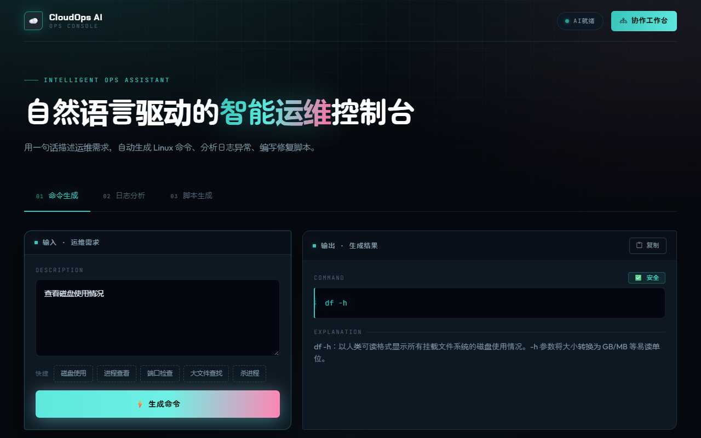
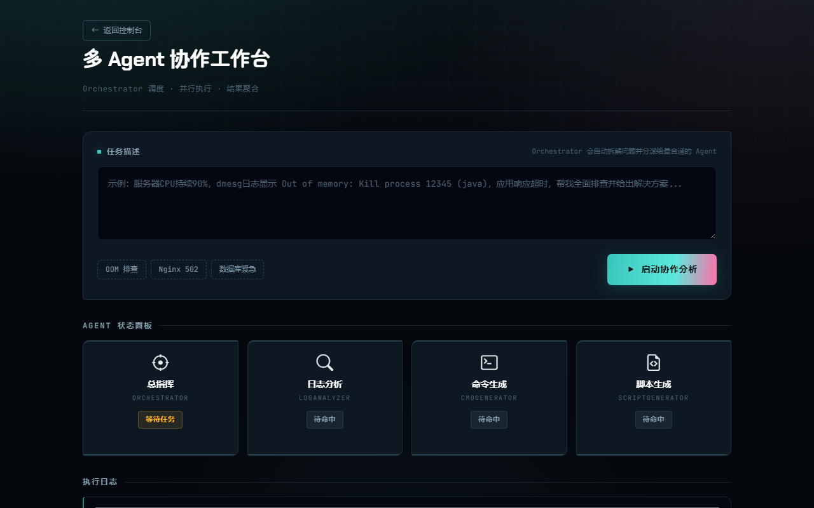
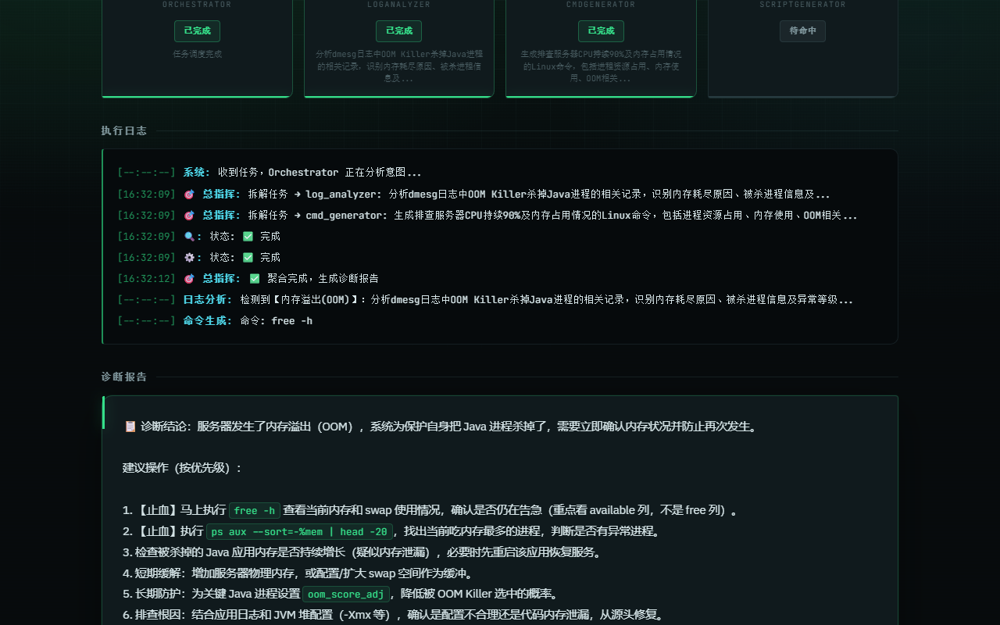

# ☁️ CloudOps AI 运维助手

> **多 Agent 协作的智能运维助手** — 用自然语言描述运维需求，AI 自动生成命令、分析日志、编写脚本。

[](https://www.python.org/)
[](https://fastapi.tiangolo.com/)
[](https://www.docker.com/)
[](./tests/)
[](./LICENSE)

---

## 📸 界面预览

**智能运维控制台** — 命令生成 / 日志分析 / 脚本生成



**多 Agent 协作工作台** — Orchestrator 调度四个 Agent 并行协作



**诊断报告** — 多 Agent 结果聚合，按优先级给出止血措施与修复步骤



---

## 🔒 关于密钥安全

本项目**不包含任何 API 密钥**，可以安全地公开：

- 真实密钥放在 `.env` 文件中（已加入 `.gitignore`，不会被提交）
- 仓库里只有 `.env.example` **占位符模板**，用于告诉使用者需要配置哪些变量
- 提交前可运行安全审计脚本自查：

```bash
python scripts/security_check.py
```

该脚本会扫描所有被 git 跟踪的文件（包括二进制 Word 文档），检测是否存在真实密钥泄露。

> ⚠️ **重要提醒**：如果你的密钥曾经被提交过，**仅仅删除文件是不够的** —— 密钥仍留在 git 历史中。
> 正确做法是立刻到模型服务商后台**吊销该密钥并重新生成**，然后再清理仓库。

---

## ✨ 核心亮点

- 🧠 **多 Agent 协作架构**：Orchestrator 总指挥自动拆解任务，并行调度三个子 Agent 协同工作
- ⚙️ **命令智能生成**：自然语言 → Linux/运维命令 + 参数解释 + 安全等级
- 🔍 **日志智能分析**：自动识别异常等级、错误类型，给出行之有效的排查步骤
- 📝 **脚本自动生成**：运维场景 → 可运行的 Shell/Python 脚本 + 使用说明 + 风险警告
- 🌐 **多模型路由**：豆包(主) → DeepSeek → OpenAI → Ollama 自动降级，永不单点故障
- 🐳 **Docker 一键部署**：多阶段构建优化，镜像体积 < 200MB

---

## 🏗️ 架构设计

```
用户输入：「服务器CPU 90%，日志有OOM，帮我排查」
                │
                ▼
┌─────────────────────────────────────┐
│      🎯 Orchestrator 总指挥          │
│   1. 意图分析 → 拆解为子任务          │
│   2. 并行调度子 Agent                │
│   3. 聚合结果 → 生成诊断报告          │
└──────┬──────────┬──────────┬────────┘
       │          │          │
       ▼          ▼          ▼
┌──────────┐ ┌──────────┐ ┌──────────┐
│ 🔍 分析   │ │ ⚙️ 命令   │ │ 📝 脚本   │
│LogAnalyzer│ │CmdGenerator│ │ScriptGenerator│
└──────────┘ └──────────┘ └──────────┘
```

---

## 🚀 快速开始

### 本地运行

```bash
# 1. 克隆项目
git clone https://github.com/csf2005314/cloudops-ai-helper.git
cd cloudops-ai-helper

# 2. 创建虚拟环境
python -m venv venv
source venv/bin/activate  # Windows: venv\Scripts\activate

# 3. 安装依赖
pip install -r requirements.txt

# 4. 配置环境变量（可选，不影响基础使用）
cp .env.example .env
# 编辑 .env 填入豆包API密钥

# 5. 启动服务
python -m src.api.main
# 访问 http://localhost:8000
```

### Docker 部署

```bash
# 构建并启动
docker-compose up -d

# 查看日志
docker-compose logs -f

# 停止
docker-compose down
```

---

## 📡 API 接口

| 方法 | 路径 | 说明 |
|------|------|------|
| `GET` | `/api/health` | 健康检查 |
| `POST` | `/api/cmd/generate` | 运维命令生成 |
| `POST` | `/api/log/analyze` | 日志智能分析 |
| `POST` | `/api/script/generate` | 运维脚本生成 |
| `POST` | `/api/orchestrate` | 🔥 多Agent协作编排 |

### 示例请求

```bash
# 命令生成
curl -X POST http://localhost:8000/api/cmd/generate \
  -H "Content-Type: application/json" \
  -d '{"input": "查看磁盘使用情况"}'

# 多Agent协作
curl -X POST http://localhost:8000/api/orchestrate \
  -H "Content-Type: application/json" \
  -d '{"input": "服务器CPU持续90%，日志显示OOM，帮我排查"}'
```

---

## 📁 项目结构

```
cloudops-ai-helper/
├── src/
│   ├── core/                   # 核心逻辑层
│   │   ├── cmd_generator.py    #   命令生成模块
│   │   ├── log_analyzer.py     #   日志分析模块
│   │   ├── script_generator.py #   脚本生成模块
│   │   └── orchestrator.py     #   多Agent编排器 🔥
│   ├── api/                    # API接口层
│   │   ├── main.py             #   FastAPI主入口 + 中间件
│   │   └── routes.py           #   路由定义 + Pydantic模型
│   └── utils/                  # 工具层
│       └── ark_client.py       #   多模型路由客户端
├── tests/                      # 测试套件（84个用例）
│   ├── test_cmd_generator.py
│   ├── test_log_analyzer.py
│   ├── test_script_generator.py
│   ├── test_orchestrator.py
│   └── test_api.py
├── static/                     # 前端页面
│   ├── index.html              #   主界面（3 Tab切换）
│   ├── orchestrate.html        #   协作工作台 🔥
│   ├── css/orchestrate.css     #   看板动画样式
│   └── js/
│       ├── app.js              #   主界面交互
│       └── orchestrate.js      #   协作看板逻辑
├── Dockerfile                  # 多阶段构建
├── docker-compose.yml          # 服务编排
├── requirements.txt            # Python依赖
├── .env.example                # 环境变量模板
└── README.md
```

---

## 🧪 测试

项目全程采用 **TDD（测试驱动开发）** 模式，核心逻辑测试全覆盖。

```bash
# 运行全部测试
pytest tests/ -v

# 运行指定模块
pytest tests/test_cmd_generator.py -v
pytest tests/test_orchestrator.py -v

# 生成覆盖率报告
pytest tests/ --cov=src --cov-report=html
```

**测试结果：84/84 passed ✅**

---

## 🛠️ 技术栈

| 层级 | 技术 | 说明 |
|------|------|------|
| 后端框架 | FastAPI | 高性能异步Web框架 |
| AI模型 | 豆包/DeepSeek/OpenAI/Ollama | 多模型路由 + 自动降级 |
| 前端 | HTML5 + Bootstrap5 + 原生JS | 响应式设计，无构建工具依赖 |
| 测试 | Pytest | 84个测试用例，TDD开发模式 |
| 容器化 | Docker + Docker Compose | 多阶段构建优化 |
| 数据校验 | Pydantic v2 | 请求参数严格校验 |
| 重试机制 | Tenacity | 指数退避自动重试 |
| 异步处理 | asyncio | 并行调度三个子Agent |

---

## 🐛 开发过程中解决的关键问题

> 记录真实的排错过程，比罗列技术栈更能说明工程能力。

### 1. `.env` 配置从未生效

**现象**：配好了模型密钥，但健康检查接口始终返回 `ai_available: false`，系统一直跑在本地规则模式。

**定位**：查看启动日志发现"未配置任何大模型"的告警；检查 `ark_client.py` 发现代码使用 `os.getenv()` 读取密钥，但项目虽然安装了 `python-dotenv`，**全项目从未调用过 `load_dotenv()`** —— `.env` 文件实际上是摆设。

**修复**：在配置读取模块中加入向上逐级查找 `.env` 的加载逻辑，支持从任意工作目录启动。

### 2. 占位符密钥被误判为有效配置

**现象**：修复上一问题后，可用模型列表里出现了 `ark:ep-20240601000000-xxxxx` 等**示例占位符**。

**原因**：判断逻辑写的是 `if ark_key:`，而占位符字符串 `"your_ark_api_key_here"` 是非空字符串，判断结果为真。

**影响**：每次请求都会先调用无效模型 → 401 → 指数退避重试 3 次 → 才降级到可用模型，**每次请求白等约 7 秒**。

**修复**：新增 `_get_env_key()` 过滤占位符（识别 `your_` 前缀、`_here` 后缀、`xxxx` 填充），并优化重试策略 —— 只有超时、连接失败、5xx、429 才重试；401/403/404 属于永久错误，直接降级不浪费时间。

### 3. 单元测试误打真实 API

**现象**：修复配置加载后，84 个测试的耗时从 **2.99 秒暴涨到 40.18 秒**。

**原因**：部分测试未做 mock，直接调用 Orchestrator；`.env` 生效后，测试开始真实请求大模型 API。

**修复**：在 pytest 环境下跳过 `.env` 加载，使单元测试与外部网络完全隔离。**测试耗时降至 0.67 秒**，且不再产生任何 API 费用。

### 4. 日志分析分支重复调用

**现象**：代码复查时发现日志分析分支把 `analyze()` 写在了字典的四个值里。

**影响**：AI 模式下同一个日志会**重复请求四次大模型 API**，慢四倍、贵四倍。

**修复**：改为先调用一次拿到结果对象，再从中取字段。

---

## 🎯 开发模式

全程遵循 **Red → Green → Refactor** TDD循环：

1. **Red**：先写测试用例定义"什么是正确的"
2. **Green**：用最少代码让测试通过
3. **Refactor**：优化结构，保持测试全绿

---

## 🔮 迭代路线图

- [x] Phase 1: 基础骨架 + 核心模块TDD
- [x] Phase 2: 大模型API接入 + 多模型路由
- [x] Phase 3: FastAPI接口层 + 前端页面
- [x] Phase 4: 多Agent协作编排 + 协作看板
- [x] Phase 5: Docker容器化
- [x] Phase 6: 测试全覆盖（84例）
- [x] Phase 7: CI/CD (GitHub Actions)
- [ ] Phase 8: 本地知识库 (RAG)
- [ ] Phase 9: 接口限流 (Redis)
- [ ] Phase 10: 用户系统 (JWT)

---

## 📄 文档版本

> **v2.1** — 新增界面改版（终端风格控制台）、修复配置加载与重复调用问题、接入 CI 自动化测试
> **面向场景**：运维岗位面试作品展示 / 智能运维工具实践
